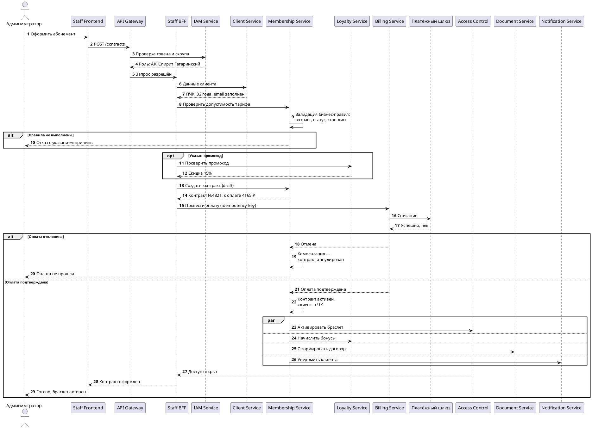

# UML Sequence UC-2. Оформление контракта

![UC-2 Оформление контракта](https://www.plantuml.com/plantuml/svg/bPXFRnFd4yVl-oeUSG8HEA3V2Ic89FmY8GfKeZrKukAQXLfrxCZUm1MIfaq50a91hL2RDEsnbyN9DXixiQMyWjctq5VI-UZnRfx7kuaR9CVUtPdl_9dlp3pBpMvKwqGhIyqWQaJDq7ovSENQLIDRsNSop9xBeGmaaID99J7Ibw4SPQjwEvP-jYfn4DHMedPhPUdhi1DqlssqbckTsfBfXDtbTgiRtWsxtTgJS3vijf_DTJhjPoRgh8IgL8_Q7ND1tih72wRMDNDtYbiVPO0jpF38B7nsEr3Gg55lBDTQaRdm8AezVcmME-rM5BOU8MCM_rybCh-uo5E-_SSBpKQetm_2pjD6FHnRyKNkXaJK_QQnx8dTdVV5vXlDPgFrn9EPlps19TiQKgnPsvI_DQoNSc2o3HbahsKV1VFvt5U-mhrsr7ZSgDUYHhlbGT-x_uKlUQjTNrcQZENM_GLVQgvU3xiQesQiqsxQX2y4mUoiaNVgpYVgR2JcXnOwaKERVedDx6mGpDqnLsveYirr8xz9h36aAX5BagsQuxySdgGQugiIHuu7HdhSZRFdYZdCVj3VK2clCuQeVkDfBGeffPfIWrerBFwiA2F56cOlZEpnfT1hCYAHsNgLrqFfdS1HU_qee9OOlFUgSOJowJv01XM-SkB4EmNT9o2ipnZ-IemVsOiPet0nE1fO2kWdAqZR81Oy2brWwumIoJhZnODsAPxifP7KA58YVJNuenevA2Mvy1s6AhRZ-uvYf-hEKFgdPCjSDXP5eNluKM70N9I4cDGLVb3fIqvacBMXMQhuTizHkA3MZ8nyi1RGI-I02-bfxAzjz1MwWT5_llrjTJsHFKpoIscxby-nwmzRSeGvGdLZJvMYQvHDJRunQeHGDv14NhLwngBWsuYOgB8XHlnH1iHOK5sdNedioZ08cztGkCCDtf1Im1Erky5jp8o9SqIevu_BoJGMS4x1-dHG7fYLiWyqVpoch4E3D-hi0FegNchGKjcKQ71B7R9nxEWTGjspNJqc3UdGaCd2-Jm_iCbO3NIWEwn2tvy_Tbobi1BvAYQe82PLI-N_n2LIJ54gHzp3rcNy9a6fZ1GIRDdNDA0rv4gV-wDYA8UEb-gQdQLRCY9tbODpI--E0CCLkCqGUQ7H3609uSTQ0Gj0zKuVY3lC8X9VEMqh9n_3PeeY3Jvaj2D0QbrlNbugpPSRhBaArD79gYjq40tqGrrOTbPjbsJ2VCf9ij6RcXTpKPyYthzkhltFm3MjNkmuo3RLZslifzoK2dyF4nmZafQDvFeuNkqhv4VDXuhBK2vF5DMcuGQBV3ehFD9ngHC7RtwLdI9Sa0Bzu2v79KMr4ePcTfqRoi6Pxe7aNb8qVy3xZJdP0HW_IVassTBFUZv0yDxp9vbXdahF4I2tSaXnkLcrSj39tMVTzYnPAwkVC_HtINHvh-beUaLhJb1xia1U_6mZlwzbX6li8m8iHbXinnt57VVRETIS77EDUW7oSQ9BdUWLW7HuNUiiCyjrIO4qVY6PuRv_i7jS08wcVZmvhxRqKIgV8FgCZQZ7CAGhz1jzlDFjlWfxyqtXTqSo4G5tzoLsUpatxKmks_66ymIpHVhdpfjjM5ZWjd15RlmDX1yCz-hN8TOeeNg7gUb7Pfg3O66qTKox0IuU3_xZENYK0qXQDV1v0x1vottEOoxPN1lFYGrofMBhjlVemm8Pk40_pbvzcmCKCs-4Eac0u6JGLJvpSi2k0dWRwvmSeKtUtfx3jXpRc5F-lP5zg5KwTLC6sxs_w4s8gUql-zwUiQUpykdIWu8YvgmZY2y--Kw1jXiirrvTtK0gDpEGdX6IuE42PRiDvufTx1vnfuU4rYR6pjIQf2GpNdPjNvOskQ_Fh1fD2zQU07CQpy7YoLANL2Ikp52U7KK95CXv8zhq2-Ov9KUmqr7rZh2LKm0rxmm_dB8fMstzqNuQTXH_Xk4Q691NdRPcscNh-8cH_7s4HcD2oY7zESdvv2eu7_ALgJb2m_fdEmeqyy_pzuO4gQv2swvovx_-NQESc9rHH7lNBd9cjCR9GZLyAMGY8nlsLKfdYCrsw5j_4U6_NpYlIxV1pNbNRR7aDOmaVPDKeGDZsNFdHvd9Jesv1i0k3t_MUk_w5UIRki9F3urAQ4-Kkdra0uPI6iGcPUnvRh12YZLFwey7XL6R2l-_5iQlD83gdD-iN7is1Uws_yDFTl4UoNxt0SYXdJyikzogAWu8nWa-VtMc40J7qCrVa0rB59ehMUAfwxoS9Ctar2mP6jM-lzdb2Rbu-PEqiehbaq5mK__gVvN-2m00)

Исходный код диаграммы

